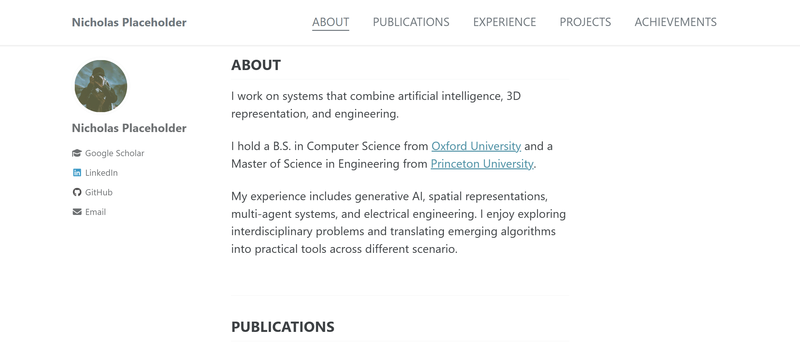
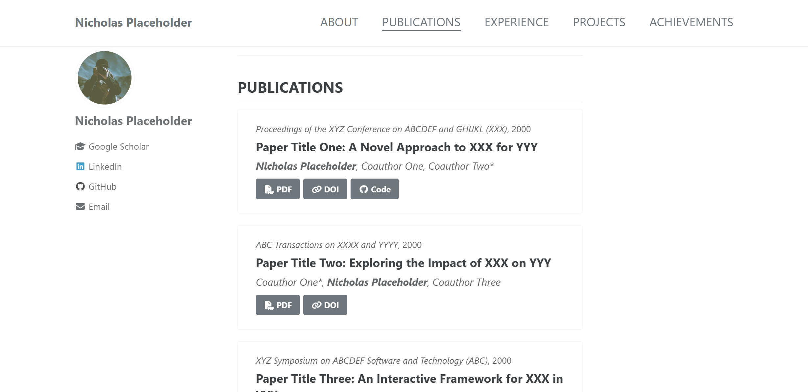
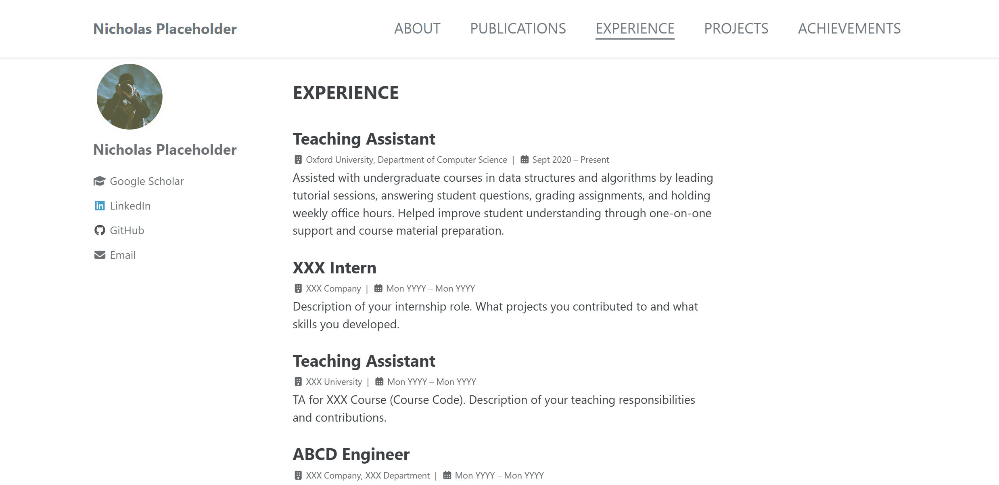
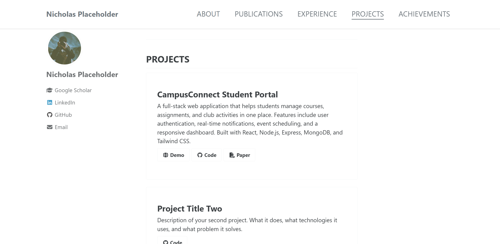
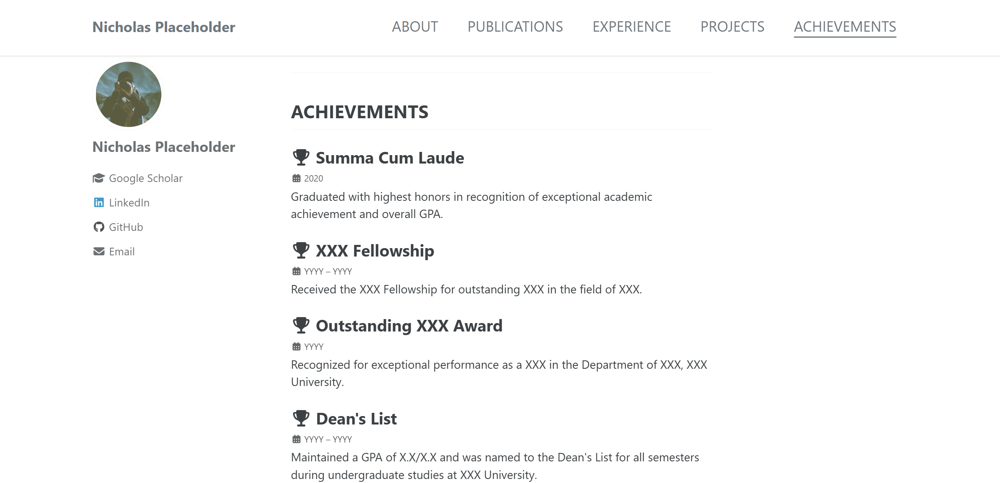

# Personal Webpage Template

A clean, single-page personal website template for academic and professional use. Built with [Jekyll](https://jekyllrb.com/) and the [Minimal Mistakes](https://mmistakes.github.io/minimal-mistakes/) theme, it provides sections for your introduction — all in one page.

## Features

- **Single-page layout** — everything on one scrollable page with smooth navigation
- **Sections** — About, Publications, Experience, Projects, and Achievements
- **Easy to customize** — edit Markdown and YAML files to update content, no HTML knowledge required
- **Responsive design** — looks great on desktop, tablet, and mobile
- **GitHub Pages ready** — deploy with GitHub Pages

## Quick Start — Local Deployment

### Prerequisites

- [Ruby](https://www.ruby-lang.org/en/downloads/) (>= 2.5)
- [Bundler](https://bundler.io/) (`gem install bundler`)

### Steps

1. Clone the repository:

   ```bash
   git clone https://github.com/kmake231/PersonalWebpage-template.git
   cd PersonalWebpage-template
   ```

2. Install dependencies:

   ```bash
   bundle install
   ```

3. Start the local server:

   ```bash
   bundle exec jekyll serve
   ```

4. Open your browser and visit: http://localhost:{port} (default:4000)

## Deploy to GitHub Pages

1. **Fork** or **clone** this repository to your own GitHub account.

2. **Rename** the repository to `yourusername.github.io` (replace `yourusername` with your actual GitHub username).

3. **Push** your changes to the `main` branch.

4. Your site will be automatically deployed at `https://yourusername.github.io`.

## How to Modify Content

| What to change | File to edit |
|---|---|
| Site title, name, avatar, social links | `_config.yml` |
| About section text | `_contents/about.md` |
| Publications | `_data/publications.yml` |
| Experience | `_data/experience.yml` |
| Projects | `_data/projects.yml` |
| Achievements | `_data/achievements.yml` |
| Navigation bar links | `_data/navigation.yml` |
| Profile photo | Replace `assets/images/bio-photo.jpg` |

## Demo Website

View website example: [https://kmake231.github.io/PersonalWebpage-template/](https://kmake231.github.io/PersonalWebpage-template/)

## Screenshots















## Credits

This template is modified based on [mm-github-pages-starter](https://github.com/mmistakes/mm-github-pages-starter). It uses the [Minimal Mistakes](https://mmistakes.github.io/minimal-mistakes/) Jekyll theme and is powered by [Jekyll](https://jekyllrb.com/).